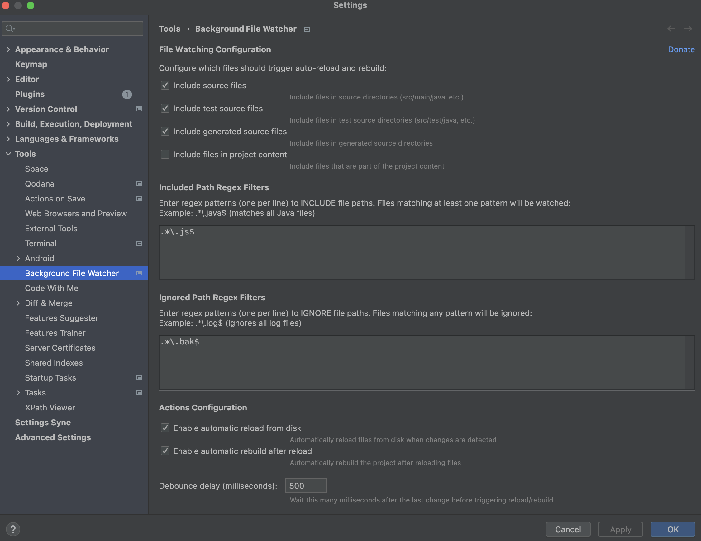
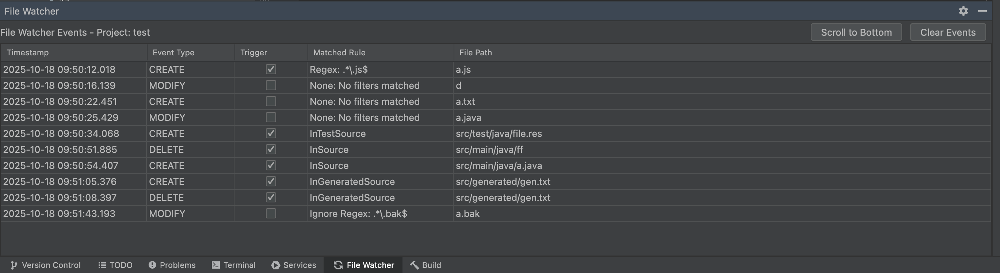

# Background File Watcher
[](https://plugins.jetbrains.com/plugin/28751)

An IntelliJ IDEA plugin that watches files in the background and triggers "Synchronize All From Disk" and build when changes are detected.

[](https://www.paypal.com/donate/?hosted_button_id=C9U54KULFG48C)

## Features

- **Watches files in the background**: Monitors your project directory for file changes using Java's WatchService API
- **Configurable Filters**: Fine-tune which files trigger reloads
  - Check if file is in source
  - Check if file is in test source
  - Check if file is in generated source
  - Check if file is in project content 
- **Regex Path Filters**: Define custom regex patterns to match specific file paths
- **Auto Reload**: Automatically triggers "Synchronize All From Disk" when changes are detected
- **Auto Rebuild**: Automatically triggers project build after synchronization
- **Debouncing**: Configurable delay to batch multiple file changes (default: 500ms)
- **Event Tracking**: Tool window showing:
  - Processed events/ignored events with timestamps and matched rules
- **Project-Level Settings**: Each project has its own independent configuration stored in `.idea/workspace.xml`

## Building the Plugin

To build the plugin, you need:
- JDK 17 or later
- Gradle (or use the Gradle wrapper if configured)

Build the plugin:
```bash
./gradlew buildPlugin
```

The built plugin will be in `build/distributions/`.

## Installing the Plugin

1. Build the plugin as described above
2. In IntelliJ IDEA, go to `Settings/Preferences` → `Plugins`
3. Click the gear icon and select `Install Plugin from Disk...`
4. Select the ZIP file from `build/distributions/`
5. Restart IntelliJ IDEA

## Running the Plugin in Development

To test the plugin in a sandboxed IntelliJ IDEA instance:
```bash
./gradlew runIde
```

## How It Works

1. When a project is opened, the `ProjectOpenListener` is triggered
2. The `FileWatcherService` is initialized and starts watching the project directory
3. The service recursively registers watchers for all directories except excluded ones (using IntelliJ's ProjectFileIndex)
4. When a file change is detected, it checks against configured filters and regex patterns
5. If relevant changes are detected, it schedules a reload (with configurable debounce delay)
6. The reload triggers IntelliJ's synchronization action to refresh files from disk
7. Optionally triggers a project rebuild after synchronization

## Screenshots

### Configuration Settings
Configure filtering, regex patterns, and auto-reload behavior in the plugin settings:



### Event Monitoring
Track file changes and see which rules matched in real-time:



## Configuration

Navigate to **Settings/Preferences → Tools → Background File Watcher** to configure:

1. **File Filtering Options**:
   - Check is in source
   - Check is in test source
   - Check is in generated source
   - Check is in project content
   
2. **Regex Path Filters**:
   - Define custom regex patterns (one per line)
   - Define ignore file patter regex
   - Patterns are validated on save

3. **Auto Actions**:
   - Enable/disable automatic reload from disk
   - Enable/disable automatic project rebuild

4. **Debounce Delay**:
   - Configure delay in milliseconds (default: 500ms)

## Tool Window

The plugin adds a "File Watcher" tool window at the bottom of the IDE:

- **Processed Events**: Shows files that triggered reload/rebuild with matched rules and timestamps so that you can adjust your regex to meet your demands

## Use Cases

This plugin is particularly useful when:
- Files are being modified by external tools or processes
- You're using code generators that modify source files
- You're syncing files from external sources
- You need immediate feedback when files change outside the IDE

## Troubleshooting

Check the IntelliJ IDEA log for messages from the plugin:
- `Help` → `Show Log in Finder/Explorer`

The plugin logs its activities with the prefix `FileWatcherService` and `ProjectOpenListener`.

## Support Development

If you find this plugin useful, please consider supporting its development:

[](https://www.paypal.com/donate/?hosted_button_id=C9U54KULFG48C)

**[Donate via PayPal](https://www.paypal.com/donate/?hosted_button_id=C9U54KULFG48C)**

Your support helps maintain and improve this plugin!

## License

This project is licensed under the MIT License - see the [LICENSE](LICENSE) file for details.
