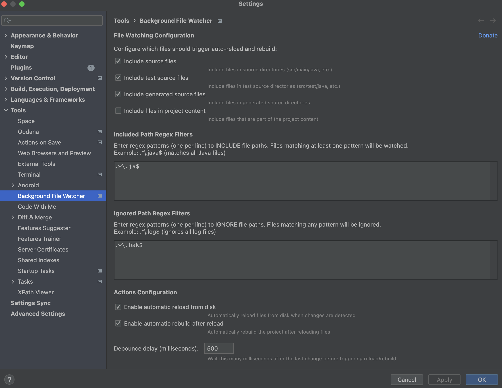
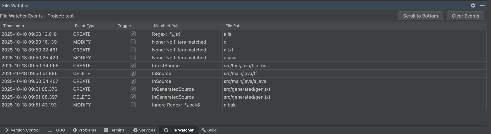

# Background File Watcher
[](https://plugins.jetbrains.com/plugin/28751)

An IntelliJ IDEA plugin that watches files in the background and triggers "Synchronize All From Disk" and build when changes are detected.

[](https://www.paypal.com/donate/?hosted_button_id=C9U54KULFG48C)

## Features

- **Watches files in the background**: Monitors your project directory for file changes using Java's WatchService API
- **Configurable Filters**: Fine-tune which files trigger reloads
  - Check if file is in source
  - Check if file is in test source
  - Check if file is in generated source
  - Check if file is in project content 
- **Regex Path Filters**: Define custom regex patterns to match specific file paths
- **Auto Reload**: Automatically triggers "Synchronize All From Disk" when changes are detected
- **Auto Rebuild**: Automatically triggers project build after synchronization
- **Debouncing**: Actions run once changes have been quiet for the configured delay (default: 500ms)
- **Event Tracking**: Tool window showing:
  - Processed events/ignored events with timestamps and matched rules
- **Project-Level Settings**: Each project has its own independent configuration stored in `.idea/workspace.xml`

## Compatibility

Requires IntelliJ IDEA 2023.3 (build 233) or newer. No upper bound is declared, so the plugin
keeps working on future IDE releases instead of being disabled when a new major version ships.

## Building the Plugin

To build the plugin, you need:
- JDK 17 or later
- Gradle (or use the Gradle wrapper if configured)

Build the plugin:
```bash
./gradlew buildPlugin
```

The built plugin will be in `build/distributions/`.

Check binary compatibility against every supported IDE release:
```bash
./gradlew verifyPlugin
```

## Installing the Plugin

1. Build the plugin as described above
2. In IntelliJ IDEA, go to `Settings/Preferences` → `Plugins`
3. Click the gear icon and select `Install Plugin from Disk...`
4. Select the ZIP file from `build/distributions/`
5. Restart IntelliJ IDEA

## Running the Plugin in Development

To test the plugin in a sandboxed IntelliJ IDEA instance:
```bash
./gradlew runIde
```

`runIde` uses the compatibility floor (2023.3). To smoke-test on a newer IDE, and optionally open
a project straight away:
```bash
./gradlew runIdeOn -PideVersion=2026.1.5 -PideProject=/path/to/some/project
```

## How It Works

1. When a project is opened, `ProjectOpenListener` starts the `FileWatcherService` if watching was enabled for that project
2. The service takes a snapshot of the module roots (source, test source, content, excluded) and derives the directories to watch from it and from the settings
3. One `RecursiveDirectoryWatcher` per project subscribes those directories with a single `WatchService` and a single thread; the deepest matching root or exclusion decides, so a generated source root inside an excluded `build` directory is still watched
4. Directories that get created are subscribed on the fly, directories that disappear are unsubscribed; when the project structure or the settings change only the directories whose membership changed are touched
5. Every event is classified against the cached roots and the compiled regex filters, then logged to the tool window
6. Events that pass the filters (re)arm the debounce timer; the actions run once the changes have been quiet for the configured delay
7. The reload refreshes the VFS from disk, and the build is started only after that refresh has finished

## Screenshots

### Configuration Settings
Configure filtering, regex patterns, and auto-reload behavior in the plugin settings:



### Event Monitoring
Track file changes and see which rules matched in real-time:



## Configuration

Navigate to **Settings/Preferences → Tools → Background File Watcher** to configure:

1. **File Filtering Options**:
   - Check is in source
   - Check is in test source
   - Check is in generated source
   - Check is in project content
   
2. **Regex Path Filters**:
   - Define custom regex patterns (one per line)
   - Define ignore file patter regex
   - Patterns are validated on save

3. **Auto Actions**:
   - Enable/disable automatic reload from disk
   - Enable/disable automatic project rebuild

4. **Debounce Delay**:
   - Configure delay in milliseconds (default: 500ms)

## Tool Window

The plugin adds a "File Watcher" tool window at the bottom of the IDE:

- **Processed Events**: Shows files that triggered reload/rebuild with matched rules and timestamps so that you can adjust your regex to meet your demands

## Use Cases

This plugin is particularly useful when:
- Files are being modified by external tools or processes
- You're using code generators that modify source files
- You're syncing files from external sources
- You need immediate feedback when files change outside the IDE

## Troubleshooting

Check the IntelliJ IDEA log for messages from the plugin:
- `Help` → `Show Log in Finder/Explorer`

The plugin logs what it starts, subscribes, ignores and triggers under the `com.radut.plugin.bfw` loggers. Enable debug logging for that package in `Help` → `Diagnostic Tools` → `Debug Log Settings` to also see ignored events and individual directory subscriptions.

## Support Development

If you find this plugin useful, please consider supporting its development:

[](https://www.paypal.com/donate/?hosted_button_id=C9U54KULFG48C)

**[Donate via PayPal](https://www.paypal.com/donate/?hosted_button_id=C9U54KULFG48C)**

Your support helps maintain and improve this plugin!

## License

This project is licensed under the MIT License - see the [LICENSE](LICENSE) file for details.
